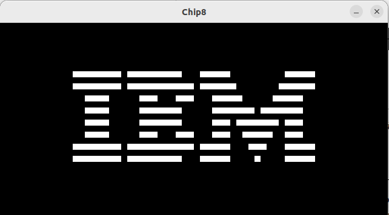
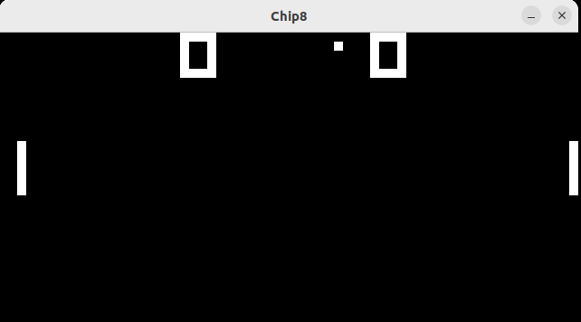
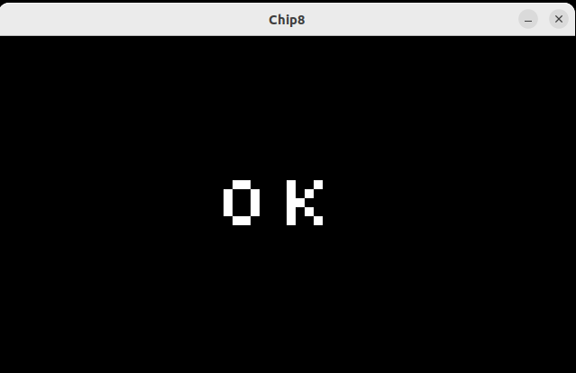
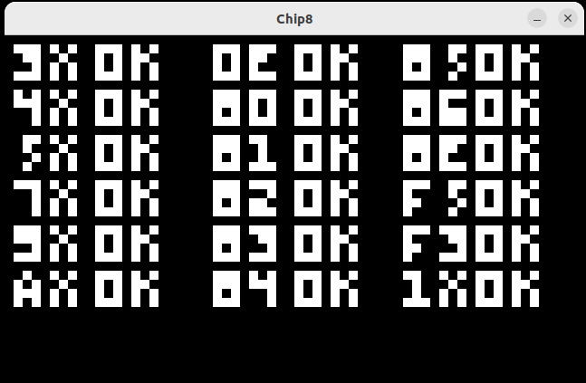

# Installing Dependencies on Ubuntu
``` bash
sudo apt install libsdl2-dev
```
# Building
``` bash
$ mkdir -p build
$ cd build
$ cmake ..
$ cmake --build .
```

# Running
``` bash
$ ./build/chip8 --help
INFO: SDL version: 2.0.20
A CHIP-8 emulator
Usage:
  chip8 [OPTION...]

  -h, --help       print help screen
  -r, --rom arg    rom file to load
  -f, --freq arg   Speed of the emulation (default: 500)
  -d, --debug      Enable debug strings
  -s, --scale arg  scale factor (default: 20)
$ ./build/chip8 -r ./roms/logo.ch8
```

# Screenshots
## IBM logo


## Pong


## Test Rom 


## Test Rom 2


# References
* [Cowgod's Chip-8 Technical Reference](http://devernay.free.fr/hacks/chip8/C8TECH10.HTM)
* [Wikipedia](https://en.wikipedia.org/wiki/CHIP-8)
* [Guide to making a CHIP-8 emulator](https://tobiasvl.github.io/blog/write-a-chip-8-emulator/)